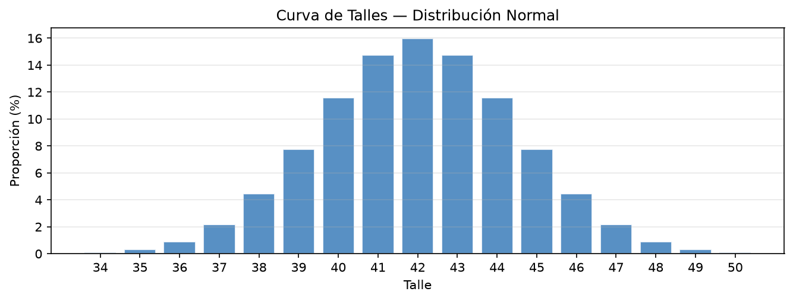
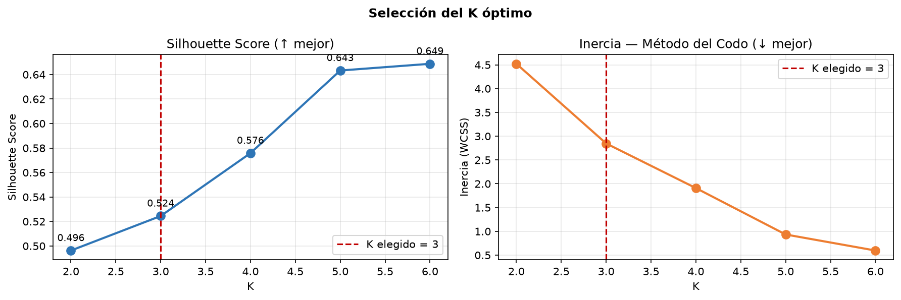

# Pronóstico y Clasificación de Insumos Críticos

Sistema de planificación de demanda e inventario desarrollado para el Proyecto Final de
Ingeniería Industrial (Maincal S.A.). Pronostica la demanda mensual de tres artículos
terminados, la traduce en requerimientos de insumos, clasifica esos insumos por criticidad y
define políticas de inventario para los críticos.

```
Etapa 1                    Etapa 2                              Etapa 3
Ventas históricas   ──►    Pronóstico × curva de talles  ──►    K-Means + score AHP  ──►  Stock de Seguridad
(36 meses × 3 art.)        × BOM  ──►  familias de compra       (K=3: criticidad)         y Punto de Pedido
   Prophet                                                                                  (insumos críticos)
```

Todo el detalle de esta página sale del código de `planificacion/` y de las ejecuciones de los
notebooks ya versionadas en el repo. Cuando un dato no se puede determinar desde el repo, se dice.

---

## Etapa 1 — Pronóstico de demanda

### Input de datos

| Ítem | Detalle |
|---|---|
| Fuente | Google Sheets exportado como `.xlsx` (`ForecastConfig.excel_url`, `planificacion/config.py`). Si no hay red se usa la copia local `ventas_historicas_cache.xlsx` |
| Formato | Ancho: una fila por artículo y una columna por mes (`ene-23`, `feb-23`, …, `dic-25`) |
| Artículos | 3: `CRONOS-N04`, `HORIZON-M09`, `TAURO 2-N04` |
| Período | Ene-2023 a dic-2025, frecuencia mensual, **36 observaciones por artículo** |
| Variable | Volumen de ventas (pares) |

### Transformación de datos

Se aplica lo mínimo indispensable (`planificacion/forecast/datos.py`):

1. **Ancho → largo** (`Articulo | Fecha | Volumen_Ventas`), traduciendo los meses en español a fechas.
2. **Validación de calidad**: cuenta de nulos y de ventas negativas. En este dataset hay 0 de ambos.
3. **Formato Prophet**: `Fecha → ds`, `Volumen_Ventas → y`.

Lo que **no** se hace: no hay transformación logarítmica ni Box-Cox, no hay tratamiento de
outliers, no hay filtro de fechas (se usa todo el histórico). Existe una función de interpolación
lineal de nulos (`interpolar_nulos`) pero no se ejecuta porque no hay nulos. Al exportar el
pronóstico, los valores negativos se recortan a 0 (las ventas no pueden ser negativas); ese
recorte no se aplica a las métricas de error.

### Modelo aplicado y parámetros

**Prophet**, un modelo por artículo (las series tienen escalas y dinámicas distintas).
Configuración fija: estacionalidad semanal y diaria desactivadas (dato mensual), crecimiento
lineal, sin *holidays* ni regresores externos.

**Optimización de hiperparámetros: Random Search + cross-validation de Prophet.**

| Ítem | Valor |
|---|---|
| Iteraciones | 20 combinaciones aleatorias por artículo (semilla 42) |
| Métrica optimizada | RMSE |
| Cross-validation | `initial` 730 días · `period` 90 días · `horizon` 180 días |
| `changepoint_prior_scale` | log-uniforme en [0,01 ; 0,5] |
| `seasonality_prior_scale` | log-uniforme en [1 ; 10] |
| `seasonality_mode` | `additive` o `multiplicative` |
| `n_changepoints` | {5, 10, 15, 20, 25} |
| `yearly_seasonality` | {True, 5, 8, 10} (si es entero, es el orden de Fourier) |

Los resultados se guardan en `hiperparametros_prophet.json`; mientras no cambien los datos, la
semilla ni la grilla, no se repite la búsqueda.

**Hiperparámetros ganadores:**

| Artículo | changepoint_prior_scale | seasonality_prior_scale | seasonality_mode | n_changepoints | yearly_seasonality | RMSE (CV) |
|---|---|---|---|---|---|---|
| CRONOS-N04 | 0,335 | 2,508 | additive | 10 | 10 | 1.812,68 |
| HORIZON-M09 | 0,122 | 1,059 | multiplicative | 10 | 5 | 249,88 |
| TAURO 2-N04 | 0,100 | 6,448 | additive | 10 | 10 | 338,36 |

### Pronóstico e indicadores

Con los mejores parámetros se reentrena cada modelo con los 36 meses y se pronostican **12
meses (ene–dic 2026)**, exportados a `pronostico_ventas.xlsx`.

| Artículo | Ventas reales 2025 | Pronóstico 2026 | Promedio mensual 2026 |
|---|---|---|---|
| CRONOS-N04 | 144.227 | 121.993 | 10.166 |
| HORIZON-M09 | 34.774 | 39.166 | 3.264 |
| TAURO 2-N04 | 42.547 | 43.358 | 3.613 |

**Indicadores de error.** El pipeline calcula MSE, RMSE, MAE y R² (`forecast/metricas.py`). Se
reportan en dos versiones (valores de `Pronostico_Ventas.ipynb`, celdas 23 y 25):

*Ajuste sobre el histórico (in-sample, 36 meses):*

| Artículo | RMSE | MAE | R² |
|---|---|---|---|
| CRONOS-N04 | 405,79 | 328,61 | 0,97 |
| HORIZON-M09 | 460,51 | 365,00 | 0,59 |
| TAURO 2-N04 | 224,77 | 172,01 | 0,94 |

*Validación fuera de muestra (out-of-sample):* se entrena con los primeros 24 meses (ene-2023 a
dic-2024) y se evalúan los últimos 12 (ene–dic 2025). Se compara contra un **baseline naive
estacional** (cada mes se predice con el mismo mes del año anterior).

| Artículo | Prophet RMSE | Prophet MAE | Prophet R² | Naive RMSE | Naive MAE | Naive R² |
|---|---|---|---|---|---|---|
| CRONOS-N04 | 4.347,53 | 4.284,16 | −5,67 | 1.409,90 | 913,83 | 0,30 |
| HORIZON-M09 | 771,88 | 687,90 | −2,62 | 361,86 | 230,42 | 0,21 |
| TAURO 2-N04 | 1.198,96 | 1.078,38 | −4,83 | 416,10 | 269,75 | 0,30 |

R² promedio fuera de muestra: Prophet **−4,37** vs. naive **0,27**. Ver la sección
[Limitaciones](#limitaciones-y-observaciones): en este hold-out Prophet no supera al baseline.

---

## Etapa 2 — Desagregación de la demanda y explosión de la BOM

El pronóstico es por artículo, pero la lista de materiales (BOM) está por **artículo × talle**.
La curva de talles es el puente entre ambos.

### Curva de talles

Distribución normal discretizada y normalizada a suma 1 (`insumos/curva_talles.py`):

```
p(talle) = φ(talle; μ = 42, σ = 2,5) / Σ φ(t; 42, 2,5)      para talles 34 a 50
```

Los parámetros (`talle_media = 42`, `talle_desvio = 2.5`, `talle_min = 34`, `talle_max = 50`)
son **valores fijados en `planificacion/config.py`**, no estimados con datos: el repo no contiene
ventas por talle.



| Talle | 34 | 35 | 36 | 37 | 38 | 39 | 40 | 41 | **42** | 43 | 44 | 45 | 46 | 47 | 48 | 49 | 50 |
|---|---|---|---|---|---|---|---|---|---|---|---|---|---|---|---|---|---|
| % | 0,10 | 0,32 | 0,90 | 2,16 | 4,44 | 7,77 | 11,59 | 14,74 | **15,97** | 14,74 | 11,59 | 7,77 | 4,44 | 2,16 | 0,90 | 0,32 | 0,10 |

### Relación entre la demanda proyectada y la BOM

`BOM_Zapato_Terminado.xlsx` tiene 1.172 filas con `Material · Articulo · Talle · Componente ·
Nombre del componente · Cantidad · UM · Proveedor · Precio · Moneda · Lead Time`. Incluye 6
artículos; solo 3 tienen pronóstico (los otros —ARGOS 2-N04, JANO 2-N04 y SOUL-G09— se ignoran).

El consumo proyectado de cada componente es:

```
Consumo = Σ_talles ( Pronóstico_artículo × p_talle × Cantidad_BOM )        (insumos/bom.py)
```

**Ejemplo: CRONOS-N04, septiembre 2026, talle 42**

| Paso | Cálculo | Resultado |
|---|---|---|
| Pronóstico del artículo (todos los talles) | `pronostico_ventas.xlsx` | 10.574,58 pares |
| Proporción del talle 42 | 15,97 % | 0,159676 |
| Demanda del talle 42 | 10.574,58 × 0,159676 | **1.688,51 pares** |
| PUNTERA ACERO 59 NORMAL T10 (1 PAA por par) | 1.688,51 × 1 | **1.688,51 PAA** |
| CONJ SISTEMA PU, componente 3000093 (159,929 g por par) | 1.688,51 × 159,929 | **270.041,7 g** |
| CONJ SISTEMA PU, componente 3000094 (323,238 g por par) | 1.688,51 × 323,238 | **545.790,6 g** |

Para un talle extremo (34, proporción 0,0954 %) la misma cuenta da apenas 10,09 pares.

### Insumos seleccionados y agrupados por familias

Los insumos que solo difieren por talle se consolidan en una **familia de compra**, que es la
unidad real de decisión de Compras (`insumos/familias.py`: se quita el sufijo de talle y se
aplican reglas explícitas, por ejemplo todas las `PUNTERA ACERO …` → `PUNTERA ACERO 59 NORMAL`).

| Nivel | Cantidad |
|---|---|
| Artículos padre con pronóstico | 3 |
| Insumos base (componentes sin sufijo de talle) | 90 |
| **Familias de compra que entran al análisis** | **24** |
| Familias de producción interna (capelladas y plantillas semielaboradas, sin proveedor) | 7 |
| **Familias en el alcance de Compras (insumos a analizar)** | **17** |

Las 7 de producción interna se incluyen en el clustering (para que la normalización no cambie)
pero se excluyen de los resultados, porque no se compran.

---

## Etapa 3 — Criticidad (K-Means + AHP) y política de inventario

### Variables de entrada

Para cada una de las 24 familias (`insumos/features.py`):

| Variable | Definición | Interpretación |
|---|---|---|
| `Vol_norm` | Consumo total ÷ máximo de su unidad de medida × 100 | Peso relativo del insumo (gramos, pares y unidades no son comparables entre sí) |
| `Alcance_pct` | Artículos padre que lo usan ÷ 3 × 100 | Cuántos productos se frenan si falta |
| `LeadTime_norm` | Lead time escalado min-max a 0–100 | Riesgo de reposición |

Antes del K-Means, las tres variables se llevan a [0, 1] con `MinMaxScaler`.

### Definición de K = 3 y análisis del codo

Se evaluó K = 2 a 6 con la misma entrada y semilla (`random_state = 42`, `n_init = 20`):

| K | Silhouette | Inercia |
|---|---|---|
| 2 | 0,496 | 4,522 |
| **3** | **0,524** | **2,847** |
| 4 | 0,576 | 1,909 |
| 5 | 0,643 | 0,933 |
| 6 | 0,649 | 0,596 |



Lectura honesta del análisis:

- La inercia baja de forma continua y **no muestra un codo pronunciado**. El mayor cambio de
  pendiente ocurre justamente en K = 3 (la caída por cluster agregado pasa de 1,67 a 0,94), lo
  que respalda K = 3 de forma moderada; después la caída se mantiene casi constante hasta K = 5.
- El silhouette **sigue subiendo hasta K = 6 (0,649)**, así que no elige K = 3 por sí solo.
- **K = 3 es una decisión de negocio**: se necesitan tres niveles de criticidad que Compras pueda
  accionar (CRÍTICO / IMPORTANTE / SECUNDARIO). Con K = 3 el silhouette (0,524) indica una
  estructura razonable. Está fijado en `InsumosConfig.k_clusters`.

### Selección de insumos prioritarios

El K-Means agrupa por proximidad en las tres variables. **Los pesos AHP no entran al
clustering**: se usan después, para ordenar los tres centroides y ponerles nombre. El cluster
cuyo centroide tiene mayor score es el CRÍTICO.

```
Score AHP = 0,604 · Alcance_pct + 0,312 · LeadTime_norm + 0,084 · Vol_norm
```

| Cluster | Vol_norm | Alcance_pct | LeadTime_norm |
|---|---|---|---|
| CRÍTICO | 96,6 | 66,7 | 44,3 |
| IMPORTANTE | 12,4 | 44,4 | 62,5 |
| SECUNDARIO | 13,6 | 33,3 | 1,9 |

(Centroides en escala original, sobre las 24 familias.)

**Resultado en el alcance de Compras (17 familias):**

| Criticidad | Familia | Vol_norm | Alcance_pct | LeadTime_norm | Score AHP |
|---|---|---|---|---|---|
| CRÍTICO | CONJ SISTEMA PU | 100,0 | 100,0 | 100,0 | 100,00 |
| CRÍTICO | PUNTERA ACERO 59 NORMAL | 100,0 | 66,7 | 87,5 | 75,97 |
| CRÍTICO | CAJA EMPAQUE (BOTA/BOTÍN) | 100,0 | 66,7 | 62,5 | 68,17 |
| CRÍTICO | CORDON TRENZ NEGRO, 0,90m | 100,0 | 66,7 | 0,0 | 48,67 |
| IMPORTANTE | SISTEMA PU TINTA, GRIS | 2,5 | 100,0 | 62,5 | 80,11 |
| IMPORTANTE | SISTEMA PU TINTA, NEGRO | 0,5 | 66,7 | 62,5 | 59,81 |
| IMPORTANTE | PUNTERA ALUMINIO 459 NORMAL | 21,2 | 33,3 | 87,5 | 49,22 |
| IMPORTANTE | INSERTO B/PU UL DELANTERO | 21,2 | 33,3 | 62,5 | 41,42 |
| IMPORTANTE | INSERTO B/PU UL TRASERO | 21,2 | 33,3 | 62,5 | 41,42 |
| IMPORTANTE | SISTEMA PU TINTA, HUESO | 0,2 | 33,3 | 62,5 | 39,65 |
| IMPORTANTE | SISTEMA PU ADITIVO FILTRO UV | 0,05 | 33,3 | 62,5 | 39,64 |
| SECUNDARIO | PLANTILLA VIS CONF MA | 21,0 | 33,3 | 5,0 | 23,45 |
| SECUNDARIO | ETIQ COLG VORAN CALZADO DE SEGURIDAD | 23,7 | 33,3 | 0,0 | 22,12 |
| SECUNDARIO | CORDON TRENZ C/PIN, NAT/MA, 1,20 | 17,9 | 33,3 | 0,0 | 21,64 |
| SECUNDARIO | CORDON TRENZ C/RFX, MA 501, 1,20m | 17,9 | 33,3 | 0,0 | 21,64 |
| SECUNDARIO | CORDON TRENZ C/RFX, MA 501, 1,05m | 3,3 | 33,3 | 0,0 | 20,41 |
| SECUNDARIO | CORDON TRENZ C/PIN, NAT/MA, 1,05 | 3,3 | 33,3 | 0,0 | 20,41 |

Total: **4 críticos, 7 importantes, 6 secundarios**. La tabla completa, con el detalle por SKU
hijo (talles), está en `Insumos_Criticos.xlsx`. Nótese que la etiqueta la define el cluster, no
el score individual: por eso `SISTEMA PU TINTA, GRIS` (score 80,11) queda IMPORTANTE y `CORDON
TRENZ NEGRO, 0,90m` (48,67) queda CRÍTICO.

### Política de inventario: Stock de Seguridad y Punto de Pedido

Se definen políticas para tres insumos críticos (`config.py`, `POLITICAS_POR_DEFECTO`):

| Insumo | Política | Revisión |
|---|---|---|
| CONJ SISTEMA PU | Continua (s, Q) | Al caer al punto de pedido |
| PUNTERA ACERO 59 NORMAL | Periódica (R, S) | R = 1 mes |
| CAJA EMPAQUE (BOTA/BOTÍN) | Periódica (R, S) | R = 1 mes |

**Fórmulas** (`insumos/politicas.py`), con `Z = 2,05` (≈ 98 % de nivel de servicio):

```
Horizonte (meses) = LT (días) / 30 + R
Stock de Seguridad = Z · σ_mensual · √Horizonte
Punto de Pedido (ROP) o Nivel Objetivo (S) = d̄_mensual · Horizonte + Stock de Seguridad
Stock Máximo = ROP + d̄_mensual · ciclo          (ciclo = 1 mes en continua; R en periódica)
```

- **d̄** es el promedio mensual del pronóstico 2026, propagado por la curva de talles y la BOM.
- **σ** es el desvío del residuo *histórico − ajuste del modelo* sobre los meses de entrenamiento
  (in-sample), propagado por la BOM y sumado en cuadratura entre artículos (se asume
  independencia).
- El lead time viene de la BOM (máximo entre talles de la familia).

**Ejemplo numérico: CONJ SISTEMA PU** (revisión continua)

| Dato | Valor |
|---|---|
| Demanda media mensual d̄ | 8.405.980,2 g |
| Desvío mensual σ | 328.335,1 g |
| Lead time | 45 días |
| R (revisión continua) | 0 |
| Z | 2,05 |

```
Horizonte          = 45 / 30 + 0                              = 1,5 meses
Stock de Seguridad = 2,05 × 328.335,1 × √1,5                  ≈    824.359,7 g
Punto de Pedido    = 8.405.980,2 × 1,5 + 824.359,7            ≈ 13.433.330,0 g
Stock Máximo       = 13.433.330,0 + 8.405.980,2 × 1           ≈ 21.839.310,2 g
```

Es decir: cuando el stock de CONJ SISTEMA PU cae a ~13,4 millones de gramos (~13,4 toneladas)
se lanza la orden de compra; el stock de seguridad equivale a 2,9 días de consumo.

**Resultados de los tres insumos** (`Politicas_Inventario_Insumos_Criticos.xlsx`):

| Insumo | UM | LT (días) | d̄ mensual | σ mensual | Stock de Seguridad | ROP / Nivel Objetivo | Stock Máximo |
|---|---|---|---|---|---|---|---|
| CONJ SISTEMA PU | g | 45 | 8.405.980,2 | 328.335,1 | 824.359,7 | 13.433.330,0 | 21.839.310,2 |
| PUNTERA ACERO 59 NORMAL | PAA | 40 | 13.779,2 | 470,5 | 1.473,2 | 33.624,8 | 47.404,0 |
| CAJA EMPAQUE (BOTA/BOTÍN) | UN | 30 | 13.779,2 | 470,5 | 1.363,9 | 28.922,4 | 42.701,6 |

Ejemplo de revisión periódica (PUNTERA ACERO): horizonte = 40/30 + 1 = 2,33 meses;
SS = 2,05 × 470,5 × √2,33 ≈ 1.473,2; nivel objetivo S = 13.779,2 × 2,33 + 1.473,2 ≈ 33.624,8.

---

## Limitaciones y observaciones

Para leer el informe con criterio, esto es lo que el repo deja abierto:

1. **Prophet no supera al baseline naive en el hold-out.** Con 24 meses de entrenamiento,
   el R² fuera de muestra es negativo en los tres artículos (promedio −4,37 vs. 0,27 del naive
   estacional). El propio notebook lo reconoce. El ajuste in-sample alto (R² 0,59–0,97) no
   implica buena capacidad predictiva.
2. **El ajuste fuera de muestra de Prophet no es reproducible bit a bit.** Prophet no fija
   semilla en su optimizador. En una re-ejecución independiente, el R² fuera de muestra dio
   −4,57 (CRONOS-N04) y −7,34 (TAURO 2-N04) contra −5,67 y −4,83 del notebook, mientras que
   HORIZON-M09 coincidió (−2,62). El ajuste in-sample y el baseline sí reproducen exacto. Las
   métricas fuera de muestra sirven como orden de magnitud, no como cifras exactas.
3. **La curva de talles es un supuesto**, no un dato: no hay ventas por talle en el repo, por lo
   que no se pudo contrastar contra una distribución empírica (χ², Q-Q).
4. **Los pesos AHP vienen de afuera del repo.** Solo se cargan los tres pesos finales
   (0,604 / 0,312 / 0,084); no está el código de la encuesta ni de la matriz de comparaciones,
   por lo que no se puede verificar en el repo el cálculo de consistencia (CR).
5. **K = 3 es una decisión de negocio, no un óptimo estadístico** (ver análisis del codo).
6. **σ in-sample es una cota mínima.** Subestima la incertidumbre de un pronóstico genuino. En
   un análisis aparte (rama `revision-cap4`) recalcular σ con el error del hold-out subió el
   Stock de Seguridad entre +51 % y +99 % según el insumo, aunque el ROP cambió solo entre
   +3 % y +5 %, porque lo domina la demanda media.
7. **Solo 3 de los 4 insumos críticos tienen política de inventario.** `CORDON TRENZ NEGRO,
   0,90m` es CRÍTICO pero no figura en `POLITICAS_POR_DEFECTO`.
8. **Indicadores de error acotados.** El pipeline calcula MSE, RMSE, MAE y R²; no calcula MAPE
   ni WAPE, que suelen pedirse en un informe de pronóstico.
9. **Pronóstico 2026 de CRONOS-N04 a la baja** (121.993 vs. 144.227 de 2025, −15 %), el artículo
   de mayor volumen de ventas. Conviene validar ese nivel con el área comercial.

---

## Estructura

```
main.py                          orquestador: las 3 etapas del pipeline
planificacion/
├── config.py                    parámetros de cada etapa (dataclasses)
├── io_datos.py                  carga de Excel de entrada/salida
├── estilos.py                   paleta de criticidad compartida
├── forecast/                    Etapa 1: pronóstico de ventas (Prophet)
└── insumos/                     Etapas 2 y 3: curva de talles, BOM, clustering, políticas
tests/                           54 tests (pytest)
docs/                            figuras usadas en este README
Pronostico_Ventas.ipynb          notebook narrativo — Etapa 1
Insumos_Criticos_KMeans.ipynb    notebook narrativo — Etapas 2 y 3
```

Archivos de datos: `ventas_historicas_cache.xlsx` (entrada), `BOM_Zapato_Terminado.xlsx` (BOM),
`hiperparametros_prophet.json` (caché de la búsqueda), `pronostico_ventas.xlsx` (salida de la
Etapa 1), `Insumos_Criticos.xlsx` y `Politicas_Inventario_Insumos_Criticos.xlsx` (salidas de la
Etapa 3).

Los notebooks documentan el razonamiento de cada etapa para el informe; la lógica que ejecutan
vive en el paquete `planificacion/` y está cubierta por tests.

## Uso

```bash
pip install -r requirements.txt
python main.py
```

Genera `pronostico_ventas.xlsx`, `Insumos_Criticos.xlsx`,
`Politicas_Inventario_Insumos_Criticos.xlsx` y los gráficos de la clasificación.

Para regenerar las figuras de este README:

```bash
python -c "
import matplotlib; matplotlib.use('Agg')
from main import explotar_demanda_en_requerimientos_de_insumos
from planificacion.config import InsumosConfig
from planificacion.insumos import clustering, curva_talles, graficos
cfg = InsumosConfig()
graficos.curva_talles(curva_talles.construir_curva_de_talles(cfg)).savefig('docs/curva_talles.png', dpi=150, bbox_inches='tight')
req = explotar_demanda_en_requerimientos_de_insumos(cfg)
X, _ = clustering.escalar_variables(req.familias_de_compra)
graficos.seleccion_k(clustering.evaluar_cantidad_de_clusters(X, cfg), cfg).savefig('docs/seleccion_k.png', dpi=150, bbox_inches='tight')
"
```

## Tests

```bash
python -m pytest tests/ -q
```
